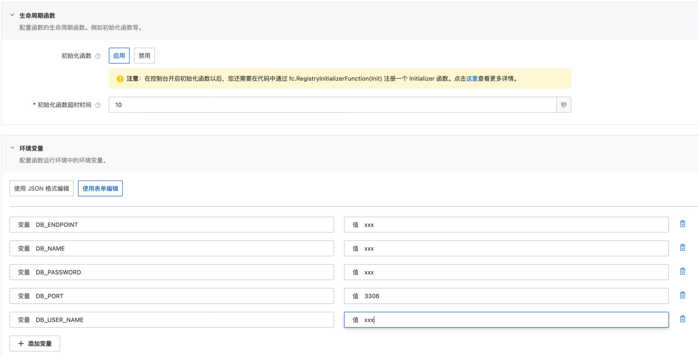

# 阿里云函数计算 Golang runtime 使用initializer初始化mysql连接池示例
本示例为您展示了如果使用 Golang runtime 的initializer回调函数来初始化mysql连接池。
在本示例中，mysql数据库配置在函数的环境变量配置中（参考s.yaml)。initializer回调函数从环境变量中获取数据库配置，创建mysql连接池并测试连通性。


## 准备开始
- 一个可用的mysql数据库，可以参考以下sql创建表并插入测试数据

```sql
CREATE TABLE `users` (
  `id` bigint(20) unsigned NOT NULL AUTO_INCREMENT,
  `name` varchar(20) NOT NULL,
  `age` tinyint(11) NOT NULL DEFAULT '0',
  PRIMARY KEY (`id`)
) ENGINE=InnoDB DEFAULT CHARSET=utf8;

INSERT INTO `users` (`id`, `name`, `age`) VALUES
(1, '张三', 25),
(2, '李四', 22),
(3, '田七', 25);
```

- 已经安装 golang 运行时（推荐使用go1.8及以上版本）。（https://golang.google.cn/）
- [可选] 安装并配置 Serverless Devs 工具。（https://help.aliyun.com/document_detail/195474.html）


## 快速开始
### 使用 Serverless Devs 工具

#### 1. 修改 s.yaml 配置
- 修改 access 配置
- 修改 environmentVariables 配置，填入 DB_USER_NAME、DB_PASSWORD、DB_ENDPOINT、DB_PORT和DB_NAME

#### 2. 部署代码
```shell
s deploy
```

#### 3. 调用测试
```shell
s invoke
```
调用函数时收到的响应如下所示：


### 使用控制台创建并测试

#### 1. 编译部署代码包
```shell
# 编译可执行程序
make build
# 打包文件
cd code && zip go-initializer-mysql.zip main
```
创建函数并上传代码包， 参考文档：[编译部署代码包](https://help.aliyun.com/document_detail/73338.htm?spm=a2c4g.11186623.0.0.6e741ba3BTJLNW#section-b9y-zn1-5wr)

#### 2. 设置initializer回调函数配置和环境变量配置


#### 3. 调用测试


## 数据库访问限制
当使用云数据库时，一般都会有访问控制，比如阿里云数据库RDS中的白名单设置（ [RDS白名单设置说明](https://help.aliyun.com/document_detail/43185.html?spm=5176.19908528.help.dexternal.6c721450iLu0jH) )。

如果仅仅作为测试，可以将白名单配置成 `0.0.0.0/0`。（不要在生产环境使用!)

在生产环境，可以使用以下两种方式访问：

1. VPC 内网访问（**推荐**） <br>
参考文档：https://help.aliyun.com/document_detail/84514.html
2. 代理<br>
参考文档：https://help.aliyun.com/document_detail/91243.html

## TODO
1. 本示例中没有连接池关闭的逻辑，连接池关闭建议放在 PreStop 实例生命周期回调函数中，golang runtime 目前暂时不支持，使用时请注意。
